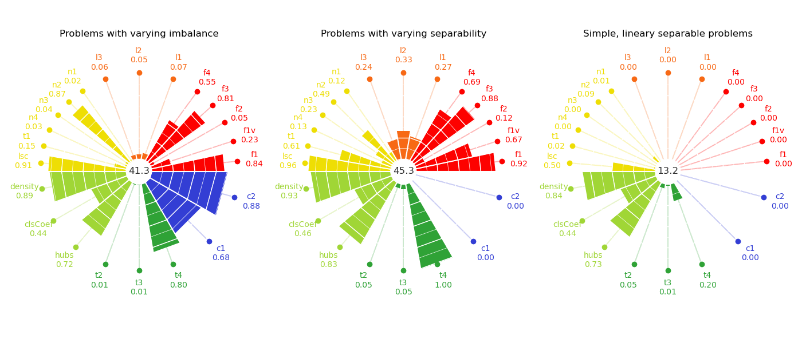

####################################
Welcome to problexity documentation!
####################################

.. toctree::
   :maxdepth: 2
   :hidden:
   :caption: Getting Started

   quickstart

.. toctree::
   :maxdepth: 2
   :hidden:
   :caption: Documentation

   class_imbalance_api
   correlation_api
   dimensionality_api
   feature_based_api
   geometry_api
   linearity_api
   neighborhood_api
   network_api
   smoothness_api
   complexity_calculator_api
   
.. toctree::
   :maxdepth: 2
   :hidden:
   :caption: Other informations

   about
   cite

The ``problexity`` is a python library containing the implementation of metrics describing the complexity of the classification problem. The implementation was based on the publication of Lorena et al.

You can read more about it in the User Guide.

`Getting started <quickstart.html>`_
------------------------------------

To use the `problexity` package, it will be absolutely useful to install it. Fortunately, it is available in the PyPI repository, so you may install it using `pip`::

  pip install -U problexity

You can also install the module cloned from Github using the setup.py file if you have a strange, but perhaps legitimate need::

  git clone https://github.com/w4k2/problexity.git
  cd problexity
  make install

`API Documentation <api.html>`_
-------------------------------

Precise API description of all the classes and functions implemented in the module.

See the `README <https://github.com/w4k2/problexity/blob/master/README.md>`_
for more information.
